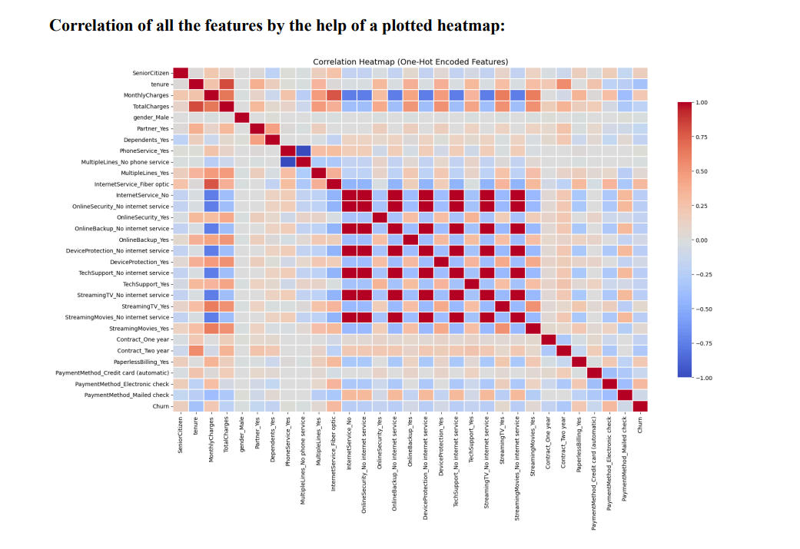
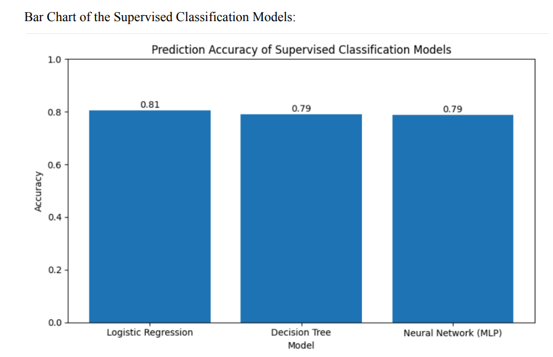
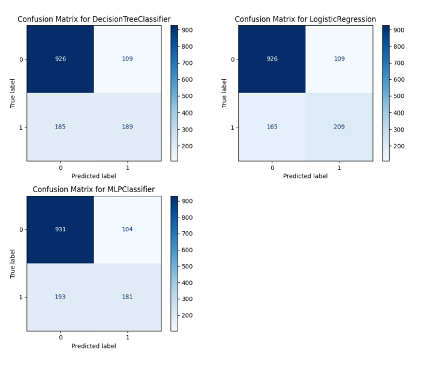
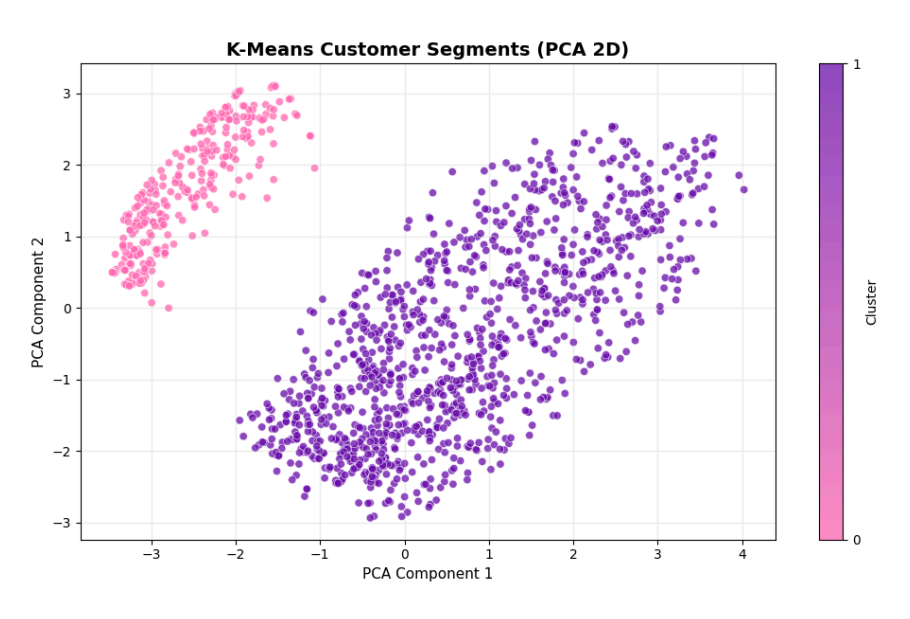

# AI-Driven Telecom Churn Prediction with ML & DL

An end-to-end Artificial Intelligence framework for predicting telecom customer churn using Machine Learning, Deep Learning, and customer segmentation techniques.

---

## Overview

Customer churn directly impacts revenue and retention strategies in the telecom industry. This project builds a complete AI pipeline to:

- Identify key churn drivers
- Compare supervised ML models
- Implement a Deep Learning model (MLP)
- Handle class imbalance
- Apply unsupervised segmentation
- Evaluate performance using advanced metrics

---

## Dataset

- 7,043 customer records
- 21 features (20 inputs + 1 target)
- Binary classification problem
- Imbalanced target distribution

The dataset includes demographic information, service subscriptions, billing attributes, and payment behavior.

---

## Key Insights

- Customers with lower tenure are significantly more likely to churn.
- Fiber optic users and electronic check payments correlate positively with churn.
- Long-term contracts strongly reduce churn probability.



---

## Preprocessing Pipeline

- Missing value handling
- One-hot encoding for categorical features
- StandardScaler normalization
- Stratified 80/20 train-test split
- Oversampling for imbalance handling
- Fully pipelined workflow to prevent data leakage

---

## Models Implemented

### Logistic Regression
- Accuracy: 80.6%
- ROC-AUC: 0.84
- Best overall performance

### Decision Tree
- Accuracy: 79.1%
- Moderate churn recall

### Neural Network (MLP)
- Accuracy: 78.9%
- Tuned deep learning model with early stopping

---

## Model Performance Comparison



Logistic Regression delivered the most balanced and reliable results across metrics.

---

## Confusion Matrix Evaluation



Logistic Regression detected more churn customers compared to other models.  
The Neural Network showed lower churn recall despite similar overall accuracy.

---

## Handling Class Imbalance

Oversampling was applied to improve minority class detection:

- Churn recall improved to ~67%
- Overall accuracy decreased to ~75%
- Trade-off reflects typical imbalance dynamics

In churn prediction, recall is prioritized over raw accuracy.

---

## Customer Segmentation (Unsupervised Learning)

K-Means clustering with PCA visualization identified two distinct segments:

- Cluster 0: ~7% churn rate (low risk)
- Cluster 1: ~32% churn rate (high risk)



While supervised learning was superior for prediction, clustering provided valuable business insight.

---

## ROC Curve Comparison

- Logistic Regression: AUC ≈ 0.84
- Neural Network: AUC ≈ 0.84
- Decision Tree: AUC ≈ 0.83

Logistic Regression maintained a consistent performance advantage.

---

## Tech Stack

- Python
- Pandas & NumPy
- Scikit-learn
- Imbalanced-learn
- Matplotlib & Seaborn
- Jupyter Notebook

---

## Installation

```bash
git clone https://github.com/yourusername/your-repo-name.git
cd your-repo-name
pip install -r requirements.txt
jupyter notebook
